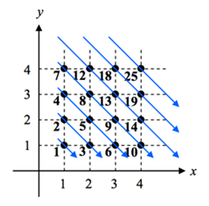
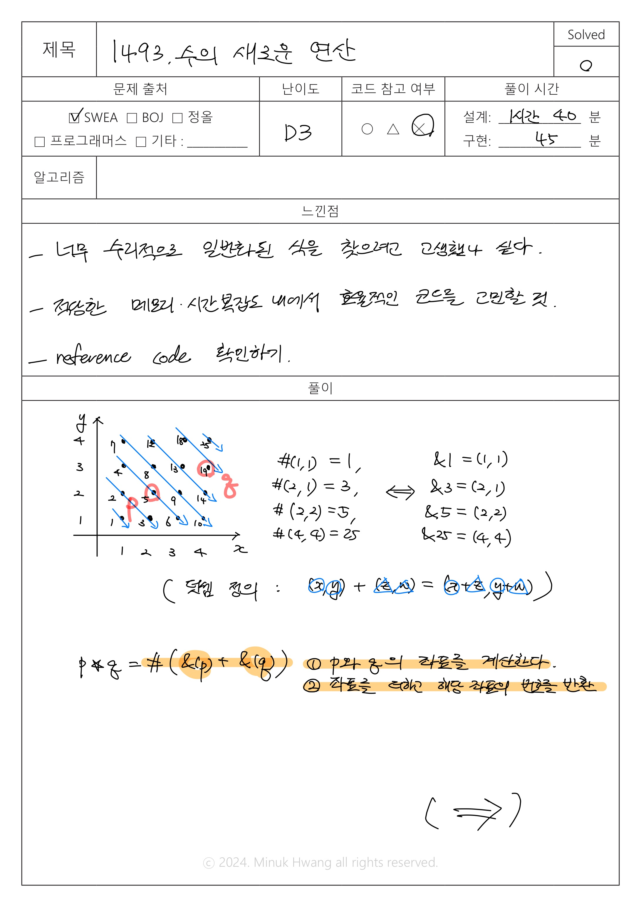
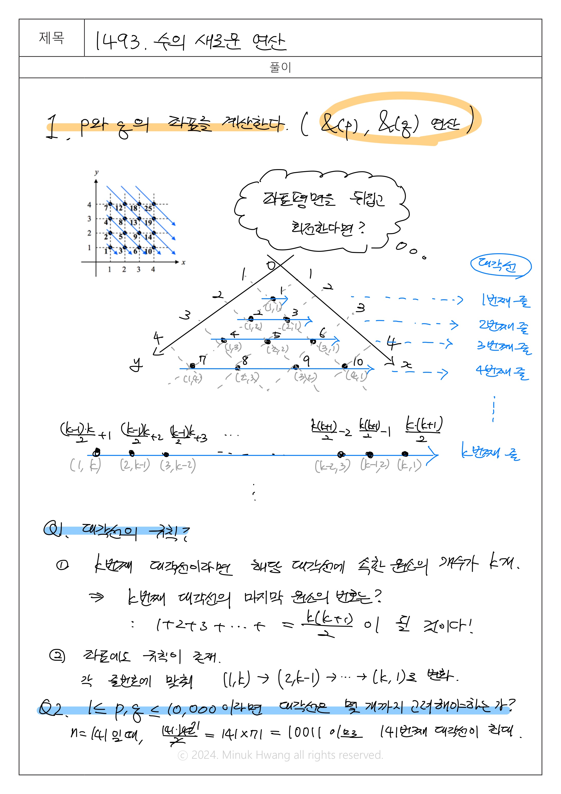
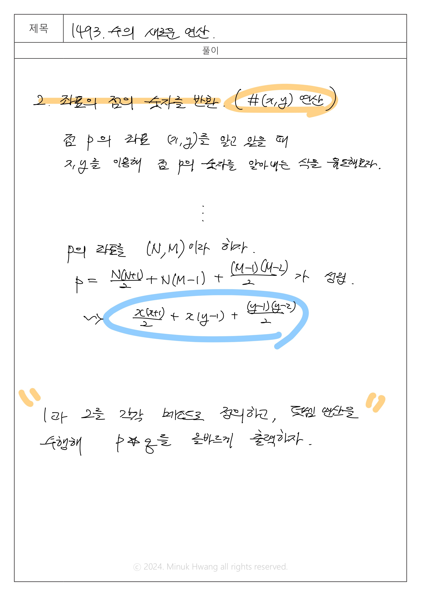

# SWEA_1493. 수의 새로운 연산 D3

출처: https://swexpertacademy.com/main/code/problem/problemDetail.do?contestProbId=AV2b-QGqADMBBASw


---

## 문제

시간 : 1000개 테스트케이스를 합쳐서 C++의 경우 1초 / Java의 경우 2초 / Python의 경우 4초  
메모리 : 힙, 정적 메모리 합쳐서 256MB 이내, 스택 메모리 1MB 이내


**※ SW Expert 아카데미의 문제를 무단 복제하는 것을 금지합니다.**




2차원 평면 제 1사분면 위의 격자점 (x,y)에 위 그림과 같이 대각선 순서로 점에 수를 붙인다.

점 (x,y)에 할당된 수는 #(x,y)로 나타낸다.

예를 들어 #(1,1) = 1, #(2,1)=3, #(2,2) = 5, #(4,4) = 25이다.

반대로 수 p가 할당된 점을 &(p)로 나타낸다.

예를 들어 &(1) = (1,1), &(3) = (2,1), &(5) = (2,2), &(25) = (4,4)이다.

두 점에 대해서 덧셈을 정의한다. 점 (x,y)와 점 (z,w)를 더하면 점 (x+z, y+w)가 된다.

즉, (x,y) + (z,w) = (x+z, y+w)로 정의한다.

우리가 해야 할 일은 수와 수에 대한 새로운 연산 ★를 구현하는 것으로, p★q는 #(&(p)+&(q))으로 나타난다.

예를 들어, &(1)=(1,1), &(5) = (2,2)이므로, 1★5 = #(&(1)+&(5)) = #((1,1)+(2,2)) = #(3,3) = 13이 된다.


**[입력]**

첫 번째 줄에 테스트 케이스의 수 T가 주어진다.

각 테스트 케이스의 첫 번째 줄에는 두 정수 p,q(1 ≤ p, q ≤ 10,000)가 주어진다.


**[출력]**

각 테스트 케이스마다 ‘#t’(t는 테스트 케이스 번호를 의미하며 1부터 시작한다)를 출력하고, 각 테스트 케이스마다 p★q의 값을 출력한다.

---

## 입출력 예시

입력  
```java
2
1 5
3 9

```

출력  
```java
#1 13
#2 26
```
---
## 풀이






---

## 생각해보면 좋을 코드

```java
package _1493;

import java.io.BufferedReader;
import java.io.FileInputStream;
import java.io.InputStreamReader;
import java.util.StringTokenizer;
 
public class Solution_ref{
    
    static int[][] arr= new int[1001][1001];
     
    static void getNum() {
        int cnt = 1;
        for (int i = 1; cnt <= 100000; i++) {
            for (int j = 1, k = i; j <= i; j++, k--) {
                arr[k][j] = cnt++;
            }
        }
    }
     
    public static void main(String args[]) throws Exception {
//    	System.setIn(new FileInputStream("src/_1493/input.txt"));
        BufferedReader br = new BufferedReader(new InputStreamReader(System.in));
        int T;
        T = Integer.parseInt(br.readLine());
        getNum();
 
        for (int test_case = 1; test_case <= T; test_case++) {
            StringTokenizer st = new StringTokenizer(br.readLine());
            int p= Integer.parseInt(st.nextToken());
            int q= Integer.parseInt(st.nextToken());
            int r1, r2,c1,c2;
            r1=r2=c1=c2=0;
             
            for (int i = 0; i < 150; i++) {
                for (int j = 0; j < 150; j++) {
                    if (arr[i][j] == p) {
                        r1 = i;
                        c1 = j;
                    }
                    if (arr[i][j] == q) {
                        r2 = i;
                        c2 = j;
                    }
                }
            }
            p=r1+r2;
            q=c1+c2;
     
 
            System.out.println("#" + test_case + " " + arr[p][q]);
 
        }
    }
}
```


