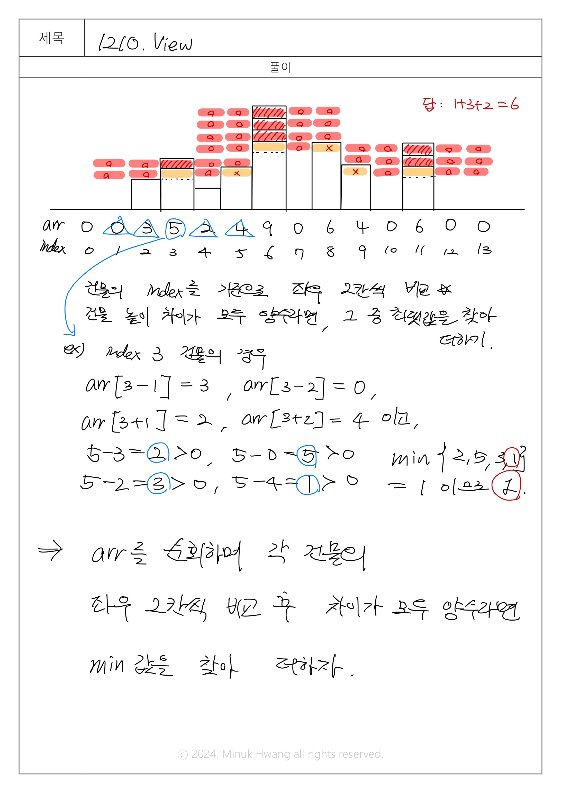

## SWEA_1206 View D3

출처: https://swexpertacademy.com/main/code/problem/problemDetail.do?contestProbId=AV5Pw_-KAdcDFAUq#none

---

## 문제
시간 : 10개 테스트케이스를 합쳐서 C++의 경우 30초 / Java의 경우 30초 / Python의 경우 30초  
메모리 : 힙, 정적 메모리 합쳐서 256MB 이내, 스택 메모리 1MB 이내

**※ SW Expert 아카데미의 문제를 무단 복제하는 것을 금지합니다.**  

강변에 빌딩들이 옆으로 빽빽하게 밀집한 지역이 있다.

이곳에서는 빌딩들이 너무 좌우로 밀집하여, 강에 대한 조망은 모든 세대에서 좋지만 왼쪽 또는 오른쪽 창문을 열었을 때 바로 앞에 옆 건물이 보이는 경우가 허다하였다.

그래서 이 지역에서는 왼쪽과 오른쪽으로 창문을 열었을 때, 양쪽 모두 거리 2 이상의 공간이 확보될 때 조망권이 확보된다고 말한다.

빌딩들에 대한 정보가 주어질 때, 조망권이 확보된 세대의 수를 반환하는 프로그램을 작성하시오.
 
아래와 같이 강변에 8채의 빌딩이 있을 때, 연두색으로 색칠된 여섯 세대에서는 좌우로 2칸 이상의 공백이 존재하므로 조망권이 확보된다. 따라서 답은 6이 된다.


A와 B로 표시된 세대의 경우는 왼쪽 조망은 2칸 이상 확보가 되었지만 오른쪽 조망은 한 칸 밖에 확보가 되지 않으므로 조망권을 확보하지 못하였다.

C의 경우는 반대로 오른쪽 조망은 2칸이 확보가 되었지만 왼쪽 조망이 한 칸 밖에 확보되지 않았다.
 
[제약 사항]

가로 길이는 항상 1000이하로 주어진다.

맨 왼쪽 두 칸과 맨 오른쪽 두 칸에는 건물이 지어지지 않는다. (예시에서 빨간색 땅 부분)

각 빌딩의 높이는 최대 255이다.
 
[입력]

총 10개의 테스트케이스가 주어진다.

각 테스트케이스의 첫 번째 줄에는 건물의 개수 N이 주어진다. (4 ≤ N ≤ 1000)

그 다음 줄에는 N개의 건물의 높이가 주어진다. (0 ≤ 각 건물의 높이 ≤ 255)

맨 왼쪽 두 칸과 맨 오른쪽 두 칸에 있는 건물은 항상 높이가 0이다. (예시에서 빨간색 땅 부분)
 
[출력]

#부호와 함께 테스트케이스의 번호를 출력하고, 공백 문자 후 조망권이 확보된 세대의 수를 출력한다.

---

## 입출력 예시

입력
```java
100
0 0 225 214 82 73 241 233 179 219 135 62 36 13 6 71 179 77 67 139 31 90 9 37 ...
1000
0 0 225 214 82 73 241 233 179 219 135 62 36 13 6 71 179 77 67 139 31 90 9 37 ...
...
```
 
 출력
 ```java
#1 691
#2 9092
...
 ```


---

## 풀이

설계 시간: 10분  
구현 시간: 45분


메모리: 42,684 kb  
실행시간: 202 ms  


> 문제 번호 1210 &rightarrow; 1206으로 정정



```java
package swea_1210_View;

import java.io.FileInputStream;
import java.util.Scanner;


public class Solution {
	public static void main(String args[]) throws Exception
	{
//		System.setIn(new FileInputStream("src/swea_1210_View/input.txt"));
		Scanner sc = new Scanner(System.in);
		int T = 10;
		for(int test_case = 1; test_case <= T; test_case++)
		{
			// 건물의 개수 N 입력
			int N = sc.nextInt();
			
			// N개의 건물의 높이를 저장할 arr 배열 선언
			int[] arr = new int[N];
			
			// 건물의 높이를 입력받아 arr에 순서대로 저장
			for (int i=0; i<N; i++) {
				arr[i] = sc.nextInt();
			}
			
			// 조망권이 확보된 세대 수(출력할 정답)
			int answer = 0;
			
			// 맨 왼쪽, 오른쪽 두 칸에는 건물이 지어지지 않으므로
			// i는 2부터 N-3까지 증가
			for (int i=2; i<N-2; i++) {
				
				// 각 건물을 기준으로 좌우 2칸씩의 건물 높이 차이(건물i의 높이-좌우 2칸 건물의 높이)를 배열로 저장
				int[] left_right = {arr[i]-arr[i-2], arr[i]-arr[i-1], arr[i]-arr[i+1], arr[i]-arr[i+2]};
				
				// 좌우 2칸씩의 건물과의 높이 차이가 모두 양수라면(조망권이 확보됐다면)
				if (left_right[0]>0 && left_right[1]>0 && left_right[2]>0 && left_right[3]>0) {
					// 높이 차이 중 min값을 찾아 answer에 더해준다.
					int min = Integer.MAX_VALUE;
					for (int k=0; k<4; k++) {
						if (left_right[k] < min) {
							min = left_right[k];
						}		
					}
					answer += min;
				}	
			}
			System.out.printf("#%d %d\n",test_case, answer);	

		}
		sc.close();
	}
}

```

---

## 느낀 점


설계 자체는 비교적 빠르게 아이디어가 떠오른 편이라고 생각한다. 조망권을 위해 하나의 건물을 기준으로 i-2, i-1, i+1, i+2의 높이를 비교해 그 중 제일 작은 양수 값을 취해 답에 더하는 로직으로 구현에 들어갔다.  

다만, 좌우 2칸씩의 높이 차이를 어떤 구조로 저장할지 구체적으로 설계하지 않았기에 구현 당시 left2, left1, right1, right2와 같이 int형 변수 4개를 선언했었는데 해당 경우, 반복문을 돌리기 어려워 min값을 찾기 어려웠다.  

이를 위해 높이 차이를 배열로 새롭게 선언하는 것에 시간을 투자해야 했다. 설계를 조금 더 구체적으로 수행했다면 구현의 시간을 줄일 수 있었을 것이다.