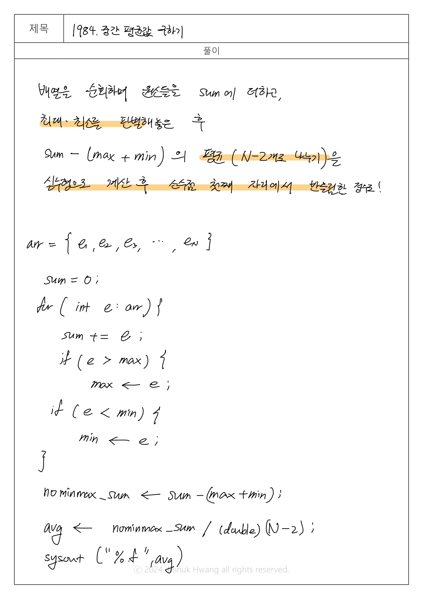

## SWEA_1984. 중간 평균값 구하기 D2

출처: https://swexpertacademy.com/main/code/problem/problemDetail.do?contestProbId=AV5Pw_-KAdcDFAUq#none

---

## 문제
시간 : 10개 테스트케이스를 합쳐서 C++의 경우 30초 / Java의 경우 30초 / Python의 경우 30초  
메모리 : 힙, 정적 메모리 합쳐서 256MB 이내, 스택 메모리 1MB 이내

**※ SW Expert 아카데미의 문제를 무단 복제하는 것을 금지합니다.**  

10개의 수를 입력 받아, 최대 수와 최소 수를 제외한 나머지의 평균값을 출력하는 프로그램을 작성하라.

(소수점 첫째 자리에서 반올림한 정수를 출력한다.)


[제약 사항]

각 수는 0 이상 10000 이하의 정수이다.


[입력]

가장 첫 줄에는 테스트 케이스의 개수 T가 주어지고, 그 아래로 각 테스트 케이스가 주어진다.

각 테스트 케이스의 첫 번째 줄에는 10개의 수가 주어진다.


[출력]

출력의 각 줄은 '#t'로 시작하고, 공백을 한 칸 둔 다음 정답을 출력한다.

(t는 테스트 케이스의 번호를 의미하며 1부터 시작한다.)

---

## 입출력 예시

입력
```java
3
3 17 1 39 8 41 2 32 99 2
22 8 5 123 7 2 63 7 3 46
6 63 2 3 58 76 21 33 8 1   

```
 
 출력
 ```java
#1 99
#2 123
#3 76
 ```


---

## 풀이

설계 시간: 5분  
구현 시간: 20분


실행시간
메모리: 21,320 kb  
실행시간: 148 ms   



```java
package swea_1984_중간평균값구하기;

import java.io.FileInputStream;
import java.util.Scanner;

public class Solution {
	public static void main(String args[]) throws Exception {
		
		
//		System.setIn(new FileInputStream("src/swea_1984_중간평균값구하기/input.txt"));
		Scanner sc = new Scanner(System.in);
		
		int T;
		T=sc.nextInt();
		
		
		for (int test_case = 1; test_case <= T; test_case++) {
			
			// 문제 조건에 따라 10개의 수를 입력받을 arr를 선언
			int[] arr = new int[10];
			
			// arr에 순서대로 정수 입력 받기			
			for (int i=0; i<10; i++) {
				arr[i] = sc.nextInt();
			}
			
			
			// 10개의 정수를 모두 더할 sum 변수 선언 및 0으로 초기화
			int sum = 0;
			// 최댓값, 최솟값을 구하기 위한 기준값 초기화
			int max = Integer.MIN_VALUE;
			int min = Integer.MAX_VALUE;
			
			
			// arr 배열을 순회하며 원소 e를 모두 sum에 더하고
			for (int e : arr) {
				sum += e;
				// 만약 원소 e가 max보다 크다면 max를 갱신
				if (e > max) {
					max = e;
				}
				// 만약 원소 e가 min보다 작다면 min을 갱신
				if (e < min) {
					min = e;
				}
			}
			
			
			// 10개의 정수를 모두 더한 sum에서 max와 min을 뺀 변수 nominmax_sum을 계산
			int nominmax_sum = sum - (max + min);
			
			
			// nominmax_sum을 8.0으로 나누고 실수형으로 변환, %.0f로 소수점 반올림
			System.out.printf("#%d %.0f\n", test_case, (double)nominmax_sum/8.0);
			
			
		}
		
	}	

}

```

---

## 느낀 점


**최댓값, 최솟값 구하는 알고리즘**은 미리 접했기에 전체 array를 순회하며 더함과 동시에 max, min을 찾고, 마지막에 계산된 sum에서 max와 min을 빼는 설계는 금방 할 수 있었다.  
쉽다고 느꼈음에도 불구하고, 평균을 구하는 과정 중 10개가 아닌 8개(max와 min, 2개를 뺀 나머지)로 나눠야함을 까먹고 10개로 sum을 나눠 코드를 실행해 답이 달라 당황했다. 쉽다고 생각해도 끝까지 방심하지 않고, 풀어야겠다.
