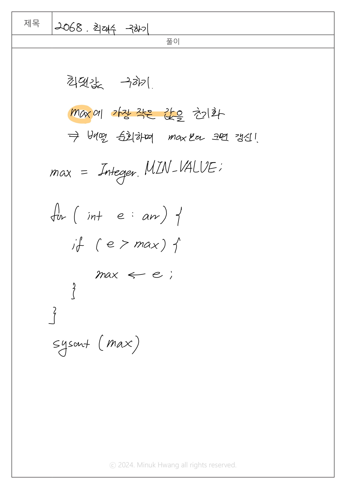

## SWEA_2068. 최대수 구하기 D1

출처: https://swexpertacademy.com/main/code/problem/problemDetail.do?contestProbId=AV5QQhbqA4QDFAUq


---

## 문제
시간 : 3개 테스트케이스를 합쳐서 C++의 경우 30초 / Java의 경우 30초 / Python의 경우 30초  
메모리 : 힙, 정적 메모리 합쳐서 256MB 이내, 스택 메모리 1MB 이내

**※ SW Expert 아카데미의 문제를 무단 복제하는 것을 금지합니다.**

10개의 수를 입력 받아, 그 중에서 가장 큰 수를 출력하는 프로그램을 작성하라.


[제약 사항]

각 수는 0 이상 10000 이하의 정수이다.


[입력]

가장 첫 줄에는 테스트 케이스의 개수 T가 주어지고, 그 아래로 각 테스트 케이스가 주어진다.

각 테스트 케이스의 첫 번째 줄에는 10개의 수가 주어진다.


[출력]

출력의 각 줄은 '#t'로 시작하고, 공백을 한 칸 둔 다음 정답을 출력한다.

(t는 테스트 케이스의 번호를 의미하며 1부터 시작한다.)

---

## 입출력 예시

입력
```java
3
3 17 1 39 8 41 2 32 99 2
22 8 5 123 7 2 63 7 3 46
6 63 2 3 58 76 21 33 8 1   

```
 
 출력
 ```java
#1 18
#2 20
#3 24
 ```


---

## 풀이

설계 시간: 3분  
구현 시간: 10분

메모리: 21,116 kb  
실행시간: 129 ms  



```java
package swea_2068_최대수구하기;

import java.util.Scanner;

public class Solution {
	public static void main(String[] args) {
		
		Scanner sc = new Scanner(System.in);
		
		int T = sc.nextInt();
		
		for(int test_case = 1; test_case <= T; test_case++) {
			
			// max값을 찾기 위해 기준값(MIN_VALUE)를 설정
			int max = Integer.MIN_VALUE;
			
			// 10개의 정수를 입력받을 arr를 선언
			int[] arr = new int[10];
			
			// 10개의 정수를 입력받으며 max와 비교해서 arr[i]가 max보다 크다면 max를 갱신 
			for (int i=0; i<10; i++) {
				arr[i] = sc.nextInt();
				if (arr[i] > max) {
					max = arr[i];
				}
			}
			
			// 결과 출력
			System.out.printf("#%d %d\n", test_case, max);
		}
	}

}
```

---

## 느낀 점

배열로 입력받은 값을 순차적으로 비교하며 최댓값(또는 최솟값)을 구하는 로직은 여러 번 반복했기에 익숙해졌다고 생각한다.  
추가적으로 arr를 입력받으면서 max값을 갱신했다는 점에서 코드 길이를 줄일 수 있었다.
